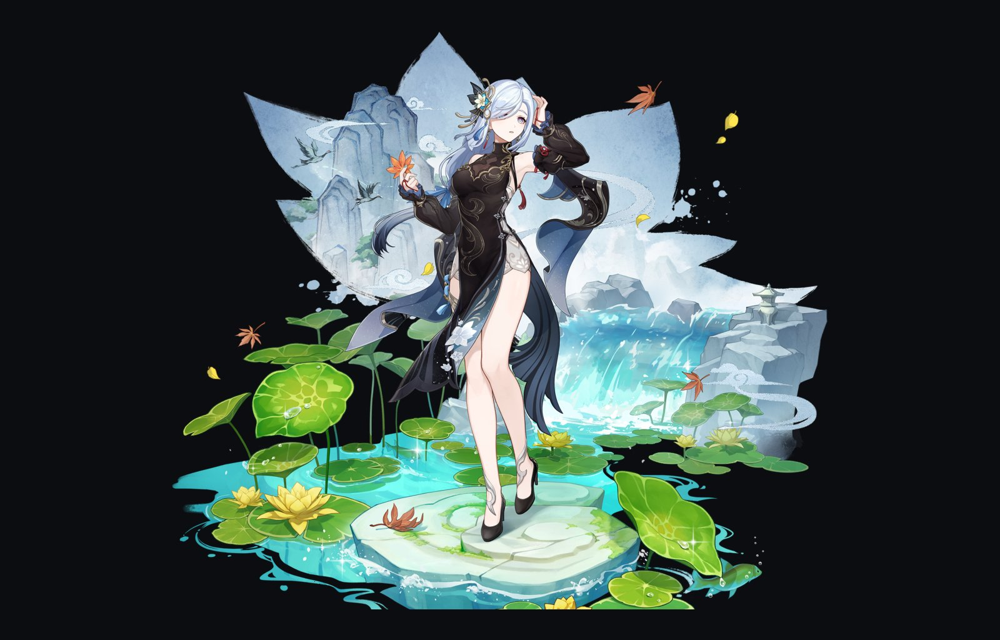
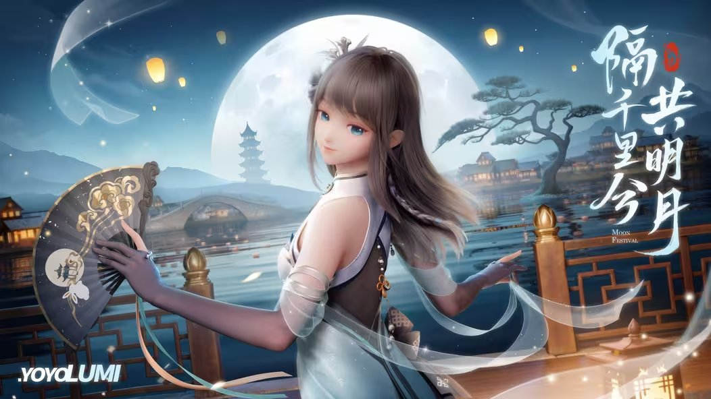

<section class="section section--showcase" id="industry">
<h2 class="section__title">Industry · miHoYo</h2>

  <figure class="work-figure showcase__main">
    
Fig. 01

    <picture>
      <source media="(max-width: 720px)" srcset="./assets/img/shenhe-960.jpg">
      
    </picture>
    <figcaption>
      <em>Shenhe</em> — 冷花幽露 · character animation
      Genshin Impact · miHoYo
    </figcaption>
  </figure>

  

    <figure class="work-figure">
      
Fig. 02

      <picture>
        <source srcset="./assets/img/lumi-moon.avif" type="image/avif">
        
      </picture>
      <figcaption>
        <em>Lumi</em> — 千里共明月 · CFX
        official PV · miHoYo
      </figcaption>
    </figure>

    

      <a class="lumi__card" href="https://www.bilibili.com/video/BV1GH4y1Z7yS" target="_blank" rel="noopener">
        <svg><use href="#i-play"/></svg>
        
          yoyo_Lumi · CFX
          bilibili · breakdown
        
      </a>
      <a class="lumi__card" href="https://www.bilibili.com/video/BV1LV4y1b7ba" target="_blank" rel="noopener">
        <svg><use href="#i-play"/></svg>
        
          yoyo_Lumi · Live Show
          bilibili · performance
        
      </a>
    

  

</section>

<section class="section" id="about">
<h2 class="section__title">About</h2>

I am <strong>Jia-Ming Lu</strong>, a researcher working at the intersection of <strong>physically-based simulation</strong>, <strong>animation</strong>, and <strong>AI for 3D content creation</strong>. I&rsquo;m deeply dedicated to unlocking the full potential of human creativity, driven by a passion for delving into the underlying, fundamental relationships between things.

  

    
2024 — now

    
<strong>ByteDance</strong> — Researcher, AI3D

  

  

    
2021 — 2024

    
<strong>miHoYo</strong> — CFX Tech Lead &amp; Cloth Simulation Topic Owner. Worked on the digital human <em>Lumi</em> and <em>Genshin Impact</em>.

  

  

    
2016 — 2021

    
<strong>Ph.D., Tsinghua University</strong> — Computer Graphics, advised by Prof. Shi-Min Hu.

  

  

    
2012 — 2016

    
<strong>B.S., Tsinghua University</strong>

  

</section>

<section class="section" id="interests">
<h2 class="section__title">Research Interests</h2>

  <strong>CG</strong> physically-based simulation
  <strong>CG</strong> differentiable simulation
  <strong>ML</strong> animation generation
  <strong>ML</strong> world model
  <strong>3D</strong> neural fields &amp; representations

</section>







<section class="section" id="games">
<h2 class="section__title">Game Achievements</h2>

Outside of work, I&rsquo;m a long-time action-game enthusiast. A few personal milestones I&rsquo;m proud of.

  

    🐺
    
      Monster Hunter
      Zinogre (雷狼龙) Arena · <strong>6:30</strong>
    
  

  

    🔥
    
      Dark Souls II
      <strong>100%</strong> achievements
    
  

  

    🗡️
    
      Sekiro: Shadows Die Twice
      <strong>100%</strong> achievements
    
  

  

    👑
    
      Elden Ring
      <strong>100%</strong> achievements
    
  

  

    
      <svg viewBox="0 0 24 24" width="20" height="20" aria-hidden="true" style="display:block">
        <defs>
          <linearGradient id="hs-orange" x1="0" y1="0" x2="0" y2="1">
            <stop offset="0" stop-color="#fdba74"/>
            <stop offset="1" stop-color="#ea580c"/>
          </linearGradient>
        </defs>
        <polygon points="12,2 20.66,7 20.66,17 12,22 3.34,17 3.34,7" fill="url(#hs-orange)"/>
      </svg>
    
    
      Hearthstone
      Top <strong>2000 Legend</strong>
    
  

</section>
