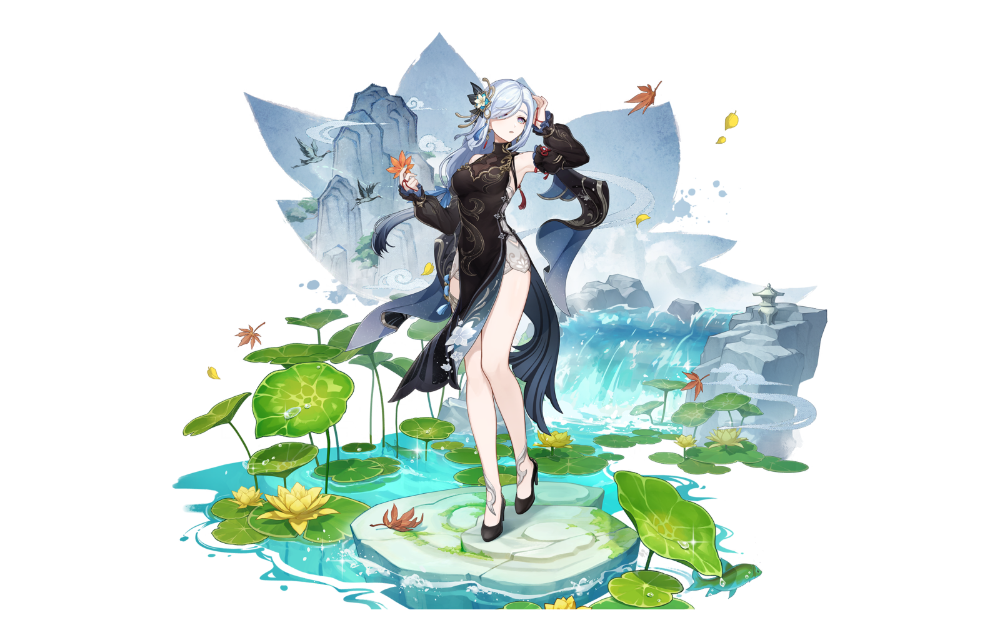

<section class="section section--showcase" id="industry">
<h2 class="section__title" data-num="I">Industry · miHoYo</h2>

  <a class="work-figure work-figure--link showcase__main" href="https://www.bilibili.com/video/BV1LV4y1b7ba" target="_blank" rel="noopener">
    
Fig. 01

    <picture>
      <source srcset="./assets/img/lumi-summer.webp" type="image/webp">
      
    </picture>
    <figcaption>
      <em>Lumi</em> — 夏日时光放映会 · live show
      ▷ bilibili
    </figcaption>
  </a>

  

    <a class="work-figure work-figure--link" href="https://www.bilibili.com/video/BV1GH4y1Z7yS" target="_blank" rel="noopener">
      
Fig. 02

      <picture>
        <source srcset="./assets/img/lumi-moon.avif" type="image/avif">
        
      </picture>
      <figcaption>
        <em>Lumi</em> — 寄明月 · CFX
        ▷ bilibili
      </figcaption>
    </a>

    <figure class="work-figure work-figure--alpha">
      
Fig. 03

      <picture>
        <source media="(max-width: 720px)" type="image/webp" srcset="./assets/img/shenhe-960.webp">
        <source media="(max-width: 720px)" srcset="./assets/img/shenhe-960.png">
        <source type="image/webp" srcset="./assets/img/shenhe.webp">
        
      </picture>
      <figcaption>
        <em>Shenhe</em> — 冷花幽露 · character animation
        Genshin Impact · miHoYo
      </figcaption>
    </figure>
  

</section>





<section class="section" id="games">
<h2 class="section__title" data-num="IV">Off the record</h2>

Outside of work I&rsquo;m a long-time action-game enthusiast. A few personal milestones I&rsquo;m quietly proud of.

  

    🐺
    
      Monster Hunter
      Zinogre (雷狼龙) Arena · <strong>6:30</strong>
    
  

  

    🔥
    
      Dark Souls II
      <strong>100%</strong> achievements
    
  

  

    🕯️
    
      Dark Souls III
      Story <strong>cleared</strong>
    
  

  

    🗡️
    
      Sekiro: Shadows Die Twice
      <strong>100%</strong> achievements
    
  

  

    👑
    
      Elden Ring
      <strong>100%</strong> achievements
    
  

  

    
      <svg viewBox="0 0 24 24" width="20" height="20" aria-hidden="true" style="display:block">
        <defs>
          <linearGradient id="hs-orange" x1="0" y1="0" x2="0" y2="1">
            <stop offset="0" stop-color="#fdba74"/>
            <stop offset="1" stop-color="#ea580c"/>
          </linearGradient>
        </defs>
        <polygon points="12,2 20.66,7 20.66,17 12,22 3.34,17 3.34,7" fill="url(#hs-orange)"/>
      </svg>
    
    
      Hearthstone
      Top <strong>2000 Legend</strong>
    
  

  

    🥁
    
      Taiko no Tatsujin
      Arcade drum · 魔王曲 <strong>季曲・夏祭 cleared</strong>
    
  

</section>
